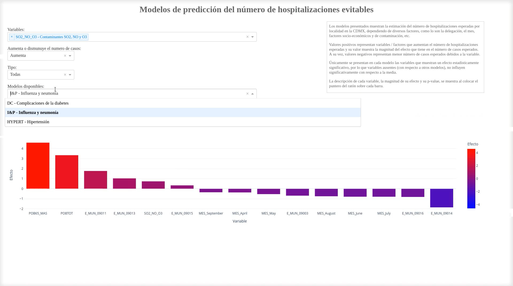

# Sistema web para la modelización del número de hospitalizaciones evitables
Los modelos presentados muestran la estimación del número de hospitalizaciones esperadas por localidad en la CDMX, dependiendo de diversos factores, como lo son la delegación, el mes, factores socio-económicos y de contaminación, etc.

Valores positivos representan variables / factores que aumentan el número de hospitalizaciones esperadas y su valor muestra la magnitud del efecto que tiene en el número de casos esperados. A su vez, valores negativos representan menor número de casos esperados debidos a la variable.

Únicamente se presentan en cada modelo las variables que muestran un efecto estadísticamente significativo, por lo que variables ausentes (con respecto a otros modelos), no influyen significativamente con respecto a la media.

La descripción de cada variable, la magnitud de su efecto y su p-value, se muestra al colocar el puntero del ratón sobre cada barra.

Es importante mencionar que el sistema no pretende ser utilizado para determinar el número de hospitalizaciones a esperar, sino que es un modelo estadístico para estudiar cómo interactúan los diferentes factores en cada enfermedad, para las hospitalizaciones ocurridas dentro de la Zona Valle de México.


El modelo final se genera mediante Regresión Binomial Negativa. El archivo PICKLE original de los modelos **no se incluye por razones de privacidad de los datos**, en su lugar se incluye un archivo PICKLE generado a partir de **datos sintéticos**.


**Proyecto CONACyT**: Observatorio de datos para descubrimientos de patrones Sociales-EspacioTemporales en Salud, Movilidad y Calidad del Aire.

**Número**: 7051.

**Objetivo**: Definir las bases de interoperabilidad para homologar la información de las bases de datos de salud, y obtener datos precisos y confiables, que permitan tener series históricas y generar la trazabilidad de los pacientes, en especial de aquellos que padecen enfermedades crónicas no transmisibles, así como la construcción de indicadores de salud y su relación con la exposición a contaminantes atmosféricos. 


## Uso
Ejecutar `ipython dash_nhosp.py`

Abrir en el navegador `http://0.0.0.0:8443/n_hosp/`




## Requisitos
`pip install -r requirements.txt`

[Archivo requirements.txt](requirements.txt)

### Lista de archivos
[dash_nhosp.py](dash_nhosp.py): Código Python para generar el dashboard de modelos predictivos para el número de hospitalizaciones.

[n_hosp.pickle](n_hosp.pickle): Archivo PICKLE de los modelos generados a partir de datos sintéticos.	

[dash_nhosp.mp4](dash_nhosp.mp4): Video del funcionamiento del dashboard de modelos predictivos para el número de hospitalizaciones.


### Repositorios relacionados
[Generación automatizada de modelos predictivos del número y severidad de las hospitalizaciones](https://github.com/cminuttim/modelos_hosp)

## Citar

```bibtex
@software{dash_nhosp,
  title = {{Sistema web para la modelización del número de hospitalizaciones evitables}},
  author = {Carlos Minutti},
  url = {https://github.com/cminuttim/dash_nhosp/},
  month = {3},
  year = {2023},
  version = {0.1},
}
```
